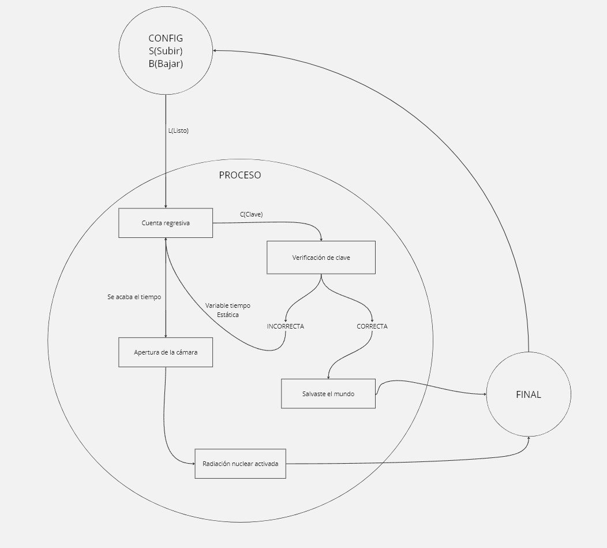

# TrabajoFinalUnidad1

# Diagrama de estados

# Código
```
enum class Task1States {
    CONFIG,
    PROCESO,
    FINAL
};

static Task1States task1State = Task1States::CONFIG;
static uint8_t TiempoParaAbrir = 5;
static uint32_t lastTime;

void task1()
{
    switch (task1State)
    {
    case Task1States::CONFIG:
    {
        char TeclaRecibida;

    
              /*Serial.print("CONFIG - Tiempo para abrir la boveda: ");
              Serial.println(TiempoParaAbrir);
              Serial.println("Presiona S para aumentar la cantidad de segundos y A para disminuirla, Presiona L para aceptar los cambios");
              */


        
        if (Serial.available() > 0)
        {
    
            TeclaRecibida = Serial.read();

            if (TeclaRecibida != 'L')
            {
                if (TeclaRecibida == 'S')
                {
                    TiempoParaAbrir++;
                    Serial.println("Tiempo para abrir la boveda: " + String(TiempoParaAbrir));
                }
                else if (TeclaRecibida == 'A')
                {
                    TiempoParaAbrir--;
                    Serial.println("Tiempo para abrir la boveda: " + String(TiempoParaAbrir));
                }
            }
            else
            {
                Serial.println("Listo");
                task1State = Task1States::PROCESO;
            }
        }

        break;
    }

   case Task1States::PROCESO:
{
    lastTime = TiempoParaAbrir;

    while (lastTime > 0)
    {
        Serial.println(lastTime);

        // Verificar si hay datos disponibles en el puerto serial
        if (Serial.available() > 0)
        {
            char inputChar = Serial.read();

            // Verificar si el primer carácter es 'C'
            if (inputChar == 'C')
            {
                // Leer los siguientes cuatro caracteres como números
                char code[4];
                for (int i = 0; i < 4; ++i)
                {
                    if (Serial.available() > 0)
                    {
                        code[i] = Serial.read();
                    }
                    else
                    {

                    }
                }


                int enteredCode = atoi(code);


                if (enteredCode == 1234)
                {
                    Serial.println("¡Salvaste al mundo!");

                    task1State = Task1States::FINAL;
                    break;  
                }
                else
                {
                    Serial.println("Contraseña incorrecta");
                }
            }
        }

        lastTime--;
        delay(1000);
    }

    // Verificar si la cuenta regresiva ha terminado
    if (lastTime <= 0)
    {
        Serial.println("Se acabó el tiempo, RADIACION NUCLEAR ACTIVA");
        task1State = Task1States::FINAL;
    }

    break;
}

        case Task1States::FINAL:
    {
   
       

        TiempoParaAbrir = 5;
        lastTime = 0;
        task1State = Task1States::CONFIG;

        break;
    }
```

# Ideación de la experiencia interactiva
Experiencia Interactiva: "Solo contra el Cosmos: Misión de Desactivación"

Introducción:
En un futuro próximo, los "Disidentes del Tiempo" han llevado al mundo al borde del desastre al tomar control de una central nuclear global. Como experto reclutado por la Resistencia, eres la única esperanza para infiltrarse y desactivar la radiación.

Infiltración y Reconocimiento:

Inicias infiltrándote en la central nuclear y localizas la interfaz de control en modo CONFIG. y luego de seleccionar el tiempo que deseas añadir y presionlr L (listo) encuentras una carta enigmática con un acertijo para desbloquear el código de desactivación.


El Desafío del Acertijo:

El acertijo:"Cuando el Cosmos susurra, el Círculo se cierra, Cuatro estrellas guían, ocultas en la esfera terrestre. Primero, tres cometas cruzan, trazando su destino, Luego, el único satélite ilumina nuestro camino. Seguido por dos soles gemelos, que el alba despierta, Y al final, cuatro galaxias en la danza eterna se insertan."

Decodifica las pistas para obtener la clave "C3124".


Administración del Tiempo y Recursos: 
El contador muestra 5 segundos para la liberación de la radiación.

Ajusta el tiempo con los botones S (Subir) y B (Bajar), pero cada 5 segundo extra usa un "código de acceso limitado". (Cuantas veces puedes poner la clave )

Consecuencias:(Revisar)


Aumentar el tiempo brinda más oportunidades, pero agota los recursos.


desactivación: 

Introduce "C3124" tras resolver el acertijo para desactivar el mecanismo y ver el mensaje de victoria.

Implementación Práctica:
Realizable en sala de escape física o entorno virtual con dispositivos Arduino. Los "códigos de acceso limitados" son esenciales, exigiendo decisiones cruciales.
